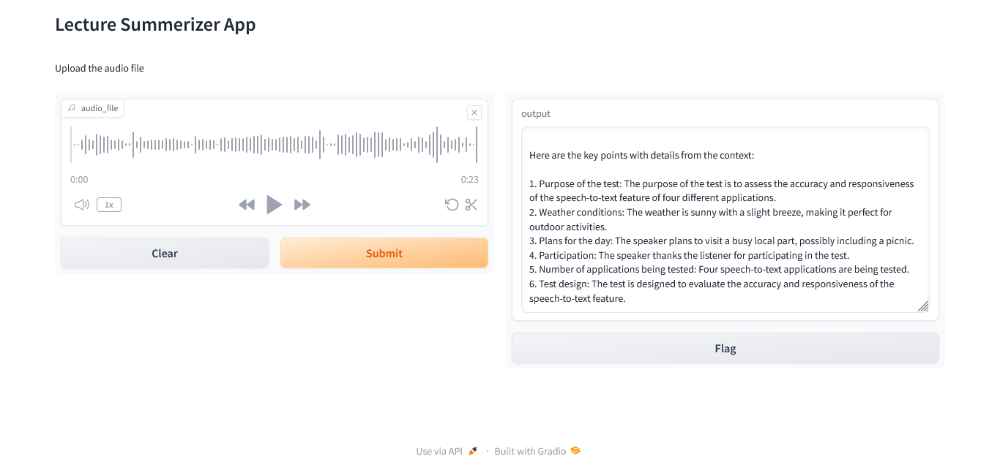

# LectureSummarizer-AI-based-student-assistant
LectureSummarizer is an AI-powered tool that transcribes and summarizes lectures. It uses OpenAI Whisper for accurate speech-to-text and Llama 2 for concise summaries. With an easy-to-use Gradio interface, it helps students capture and review key lecture points efficiently.

# Steps
- clone the project: git clone https://github.com/BlackLionXD/LectureSummarizer.git
- create & activate a virtual environment: python -m venv your_env_name, ./your_env_name/Scripts/activate 
- install requirements.txt file: pip install -r requirements.txt
- update the code by creating llama2 creadintial online for free: go to 'https://llama.meta.com/llama2/' create a credintal key.
- run the project : python main.py

# Screenshots:

